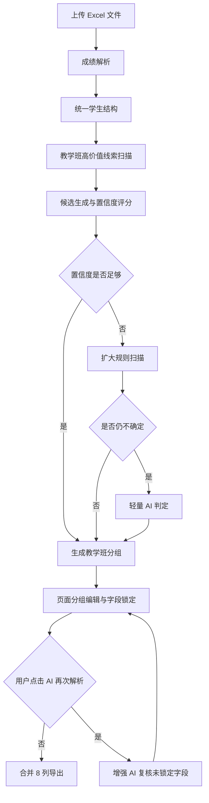

# 成绩与教学班联合清洗实施设计

## 1. 文档信息

- 项目：`grade_excel_cleaner_v1`
- 当前版本基线：`v2.1`
- 基线提交：`e6e5936 Implement grade cleaner v2.1 UI and config`
- 设计日期：2026-06-10
- 目标：在现有成绩清洗能力上增加教学班信息清洗，输出便于人工继续整理的 8 列合并表
- 非目标：本期不直接调用或对接 `kg-major` 导入接口，不要求导出文件可以无人工修改直接入库

## 2. 需求结论

页面提供两种一级解析模式：

1. `仅解析成绩`
2. `解析成绩和教学班`

`仅解析成绩`旁保留成绩识别方式下拉框：

- 混合解析
- 含课程总分
- 含课程目标

选择`解析成绩和教学班`时，仍先执行选定的成绩解析流程，再复用成绩结果中的学生姓名、学号，补充教学班元数据并生成教学班清洗结果。

最终教学班导出固定为以下 8 列，不增加课程、来源文件或来源 Sheet 等辅助列：

1. 教学班编号
2. 教学班名称
3. 运行学年
4. 学年内学期
5. 任课老师名称
6. 任课老师工号
7. 教学班学生姓名
8. 教学班学生学号

所有字段都允许为空并正常导出：

- 前 4 列尽最大可能识别或生成，无法确定时留空并提示。
- 教学班学生姓名、学号优先复用成绩清洗结果，无法获得时留空并提示。
- 任课老师名称、工号尽力提取，允许为空。
- 不因字段缺失阻止导出。
- 一个教学班没有识别到学生时，仍输出至少一行教学班记录，学生两列为空。

## 3. 模板与后端契约调查

### 3.1 教学班模板

调查文件：

`D:\Users\13952\Downloads\教学班模版 (2).xlsx`

模板包含：

- `说明` Sheet
- 每门课程一个`课程名 + 教学班配置` Sheet
- 课程配置 Sheet 第 2 行保存课程名称、课程编号
- 第 3 行为 8 个教学班字段

模板用星号标记的字段只有：

- 教学班编号
- 教学班名称
- 运行学年
- 学年内学期

### 3.2 `kg-major` 实际实现

参考：

- `MajorEvaluationVersionManager.fillCourseSheets`
- `MajorEvaluationVersionManager.importTeachingClass`
- `MajorEvaluationVersionManager.validateTeachingClassImportRows`
- `MajorEvaluationVersionManager.getTermChineseName`
- `MajorEvaluationVersionManager.getTermNumber`

调查结论：

- `kg-major` 当前导入代码实际检查 8 列非空，与模板星号标记并不完全一致。
- 教学班编号通过 `Integer.parseInt` 解析，当前代码要求整数，但没有额外检查必须大于 0。
- 模板对教学班编号增加了正整数数据校验。
- 运行学年从`YYYY-YYYY学年`的前 4 位取值。
- 学期按`第一学期、第二学期……`生成和解析。
- 同一课程内，同一教学班编号应对应一致的教学班名称、学年和学期。
- 教学班与行政班是不同业务对象，不能默认等同。

本工具不直连系统，因此采用更宽松的清洗策略：

- 原表存在教学班编号时优先保留原值，包括字母数字混合编号。
- 只有找不到编号时才稳定生成`1、2、3...`。
- 学期输出格式参考 `kg-major`，规范为`第一学期、第二学期……`。
- 保留内部追溯信息，但导出仍严格只有 8 列。

## 4. 样本调查

### 4.1 `database` 根目录

以下 6 个工作簿全部作为回归样本：

| 文件 | 主要结构线索 |
|---|---|
| `2-课程目标、毕业要求达成度计算表-2024秋.xls` | 班级位于顶部标题，课程目标为多行表头，文件名含秋季 |
| `2022级2+3+6+11班-2023年.xlsb` | 结构化列含课程号、课程名、课程班别名、学年/学期、班级 |
| `test测控电路-20测控1~6-丁炯（22-23-2）.xlsx` | 文件名含课程、行政班、教师、学期，数据列含班级 |
| `test人力22绩效管理平时成绩登记册及总成绩.xlsx` | 顶部说明行含班级、学期和教师姓名 |
| `人力22绩效管理卷面成绩登记.xlsx` | 班级为学生数据列，学年学期线索较弱 |
| `仪器仪表结构课程设计-20测135-张斌（23-24-1）.xls` | 文件名和标题同时含课程、班级、教师、学年学期 |

### 4.2 `database/成绩` 抽样

按年级和班型抽取代表性工作簿：

- 普通班：2021 级至 2025 级各 1 个
- 公费班：2021 级至 2023 级各 1 个
- 卓越班：2023 级至 2025 级各 1 个
- 优先选择文件名含`秋`的样本
- 同时覆盖只有年份、春季、秋季、多课程和超大 `.xlsb`

样本中反复出现的结构：

- 表头第 1 行：`班级课程成绩列表`
- 数据表头包含：`学号、姓名、课程号、课程名、课程班别名、成绩、学年、学期、班级`
- 实际数据中的`学年`单元格通常是`2023春`或`2023秋`
- `班级`通常是行政班，例如`2023级临床医学本科1班`
- `课程班别名`比`班级`更接近教学班名称

因此不能仅搜索`班级`或`班`并直接作为教学班名称，否则会把行政班误判为教学班。

## 5. 总体架构



新增能力分为以下独立模块：

1. 教学班候选扫描器
2. 字段候选与置信度评分器
3. 教学班分组器
4. 学年学期标准化器
5. 教师信息轻量提取器
6. 教学班 AI 规划器
7. 教学班结果校验器
8. 教学班合并导出器

现有成绩解析流程保持独立，不把教学班逻辑继续堆入已有 `planner.py` 或 `target_workflow.py`。

## 6. 页面交互

### 6.1 模式选择

页面解析控制区调整为：

- 一级选择：`仅解析成绩`、`解析成绩和教学班`
- 二级下拉：`混合解析`、`含课程总分`、`含课程目标`

一级模式只控制是否继续执行教学班流程；二级模式继续控制现有成绩解析方式。

### 6.2 解析结果

选择`解析成绩和教学班`后，结果区增加`教学班`页签或分区：

- 教学班分组列表
- 每组的编号、名称、学年、学期、教师信息
- 每个字段的置信度和来源
- 学生人数和学生明细
- 缺失字段提示
- 字段编辑状态

### 6.3 分组编辑

不能使用`教学班编号 + 教学班名称`作为内部唯一键，因为：

- 编号可能缺失或重复。
- 名称可能缺失或重复。
- 不同来源文件可能出现相同编号和名称。
- 同一文件可能识别出多个名称候选。

每个教学班生成隐藏 `group_id`。建议组成：

```text
sha1(
  file_digest
  + source_sheet
  + normalized_course_hint
  + normalized_raw_class_hint
  + normalized_school_year
  + normalized_term
  + group_ordinal
)
```

页面按 `group_id` 统一修改：

- 同一个 `group_id` 的全部学生行联动更新。
- 不同 `group_id` 即使编号或名称相同，也分别编辑。
- 出现三个教学班名时，页面展示三个组并支持逐组修改。

### 6.4 字段锁定

用户手工修改字段后：

- 自动设置 `locked_by_user = true`
- 首次或二次 AI 不覆盖该字段
- 页面允许用户主动解除锁定

### 6.5 AI 再次解析

提供按钮：

`识别不准？AI 再次解析`

行为：

- 不重复执行成绩解析。
- 只处理教学班中置信度不足或有冲突的未锁定字段。
- 扩大候选范围和上下文。
- AI 新结果直接应用。
- 保留字段变更记录，显示旧值、新值和证据。
- 调用失败时保留当前结果。

## 7. 内部数据结构

### 7.1 字段候选

```python
@dataclass
class FieldCandidate:
    field_name: str
    value: str
    source_type: str
    source_sheet: str
    cell_address: str | None
    evidence: list[str]
    score: float
    parser: str
```

`source_type`包括：

- `column`
- `top_row`
- `bottom_row`
- `key_value_neighbor`
- `filename`
- `sheet_name`
- `score_output`
- `generated`
- `llm`

### 7.2 字段结果

```python
@dataclass
class ResolvedField:
    value: str
    confidence: float
    source_type: str
    evidence: list[str]
    warning: str
    locked_by_user: bool = False
```

### 7.3 教学班分组

```python
@dataclass
class TeachingClassGroup:
    group_id: str
    class_code: ResolvedField
    class_name: ResolvedField
    school_year: ResolvedField
    term: ResolvedField
    teacher_name: ResolvedField
    teacher_code: ResolvedField
    students: pd.DataFrame
    source_file: str
    source_sheet: str
    course_hint: str
    warnings: list[str]
    revision_history: list[dict]
```

`source_file`、`source_sheet`和`course_hint`仅用于内部追溯与分组，不进入导出。

## 8. 教学班分组算法

### 8.1 分组优先级

1. `课程 + 课程班别名`
2. `课程 + 明确教学班/授课班/课程班列`
3. `课程 + 行政班`
4. `课程 + 文件名/Sheet/标题中的班级候选`
5. 没有任何班级线索时，每个明确课程形成一个待补充教学班组
6. 课程也无法识别时，按来源文件、来源 Sheet 和学生数据块形成兜底组

### 8.2 教学班与行政班区别

教学班高优先级关键词：

- 课程班别名
- 教学班名称
- 教学班
- 授课班
- 课程班
- 选课班

行政班降级关键词：

- 行政班
- 班级
- 学生班级
- 专业班
- 自然班

只出现`班级`时：

- 可以作为低优先级教学班候选。
- 必须记录“来源为行政班候选”。
- 页面显示建议复核。
- 不覆盖已识别的课程班别名。

### 8.3 成绩结果复用

建立统一学生结构：

```text
student_id
student_name
course_name
raw_class_name
source_file
source_sheet
source_row
```

- 总分成绩流程直接复用已有学号、学生姓名、课程名、班级名。
- 课程目标流程补充课程、班级元数据通道。
- 学号和姓名是学生主键，不能由教学班 AI 重写。
- 学生信息为空时保留空记录和警告，不导致教学班组消失。

## 9. 类似 Ctrl+F 的线索扫描

Python 没有 Excel 界面的 `Ctrl+F`，但可以对工作簿单元格做等价且更可控的全文检索。

### 9.1 默认低成本扫描区

每个 Sheet 默认扫描：

- 文件名
- Sheet 名
- 前 12 个非空行
- 候选表头前后各 3 行
- 最后 8 个非空行
- 已识别学生数据块的表头
- 表头对应的前 20 条数据

不在默认阶段遍历并传输整张大表的所有文本。

### 9.2 关键词命中邻域

命中关键词时提取：

- 当前单元格
- 左右各 2 个单元格
- 上下各 1 个单元格
- 同一行的少量非空单元格
- 合并单元格锚点值

对于`学年`和`学期`，额外把相邻字段作为一个联合候选块，避免分开猜错。

### 9.3 扩大扫描

默认扫描无法得到足够候选时，再按需执行：

- 全表稀疏关键词搜索
- 正则搜索学年、春秋、学期、班级模式
- 读取命中单元格所在行和列的局部窗口
- 扫描隐藏但非空 Sheet
- 扫描公式计算后的展示值
- 扩大表尾范围

不把扩大扫描作为所有文件的固定成本。

## 10. 置信度模型

每个候选以基础分、位置分、语义分、一致性分和冲突扣分组成。

### 10.1 教学班名称示例

| 证据 | 分值建议 |
|---|---:|
| 精确列名`课程班别名` | +0.55 |
| 精确列名`教学班名称/教学班/授课班` | +0.50 |
| 标题键值`教学班：xxx` | +0.42 |
| 文件名或 Sheet 名中强班级模式 | +0.25 |
| 普通`班级`列 | +0.18 |
| 同一候选覆盖多数学生行 | +0.15 |
| 与课程或学期证据相邻 | +0.08 |
| 候选是明显行政班 | -0.15 |
| 同一组出现多个不一致值 | -0.25 |
| 候选只是单独一个`班`字 | -0.30 |

### 10.2 置信度区间

- `>= 0.85`：高置信，直接采用
- `0.60-0.84`：中置信，采用并提示建议复核
- `< 0.60`：低置信，进入增强规则或 AI 兜底
- 候选分差小于 `0.10`：视为冲突，不直接覆盖

分值是实现初始值，应通过样本回归调整，但阈值含义保持稳定。

## 11. 字段抽取规则

### 11.1 教学班编号

优先级：

1. 精确教学班编号列
2. 教学班标签邻近值
3. 课程班别名中可明确分离的编号
4. 稳定生成

规则：

- 原值优先保留，不要求必须是正整数。
- 清理 Excel 数值产生的尾部 `.0`。
- 不用随机数。
- 缺失时，在同一内部课程范围内按稳定排序生成`1、2、3...`。
- 稳定排序依据：来源文件、Sheet、原始教学班线索、首次出现行号。
- 生成值标记为`generated`，页面提示可修改。

### 11.2 教学班名称

优先级：

1. 课程班别名
2. 教学班/授课班/课程班
3. 标题或键值区域中的教学班
4. 文件名、Sheet 名中的教学班候选
5. 行政班降级
6. 空值

禁止仅凭一个模糊`班`字直接生成教学班名称。

### 11.3 运行学年与学期

标准输出：

- 运行学年：`YYYY-YYYY学年`
- 学年内学期：`第一学期、第二学期……`

标准转换：

| 原始值 | 运行学年 | 学年内学期 |
|---|---|---|
| `2023秋` | `2023-2024学年` | `第一学期` |
| `2024春` | `2023-2024学年` | `第二学期` |
| `2023-2024学年第一学期` | `2023-2024学年` | `第一学期` |
| `2024/2025第2学期` | `2024-2025学年` | `第二学期` |
| `23-24-1` | `2023-2024学年` | `第一学期` |
| `23-24-2` | `2023-2024学年` | `第二学期` |

联合判断规则：

- 学年和学期作为一个联合解析对象。
- 优先使用显式完整学年学期。
- `YYYY秋`和`YYYY春`按高校常用跨年规则转换。
- 文件名、Sheet、标题和数据列冲突时，结构化数据列优先。
- 无法确认时留空，不把当前年份或文件修改时间当作学年。
- 学期数字转换成中文格式，参考 `kg-major` 的 `getTermChineseName`。

### 11.4 教师姓名和工号

教师字段采用 Python 为主：

- 精确列名匹配
- `教师姓名：xxx`、`任课教师：xxx`等键值提取
- 文件名中`课程-班级-教师（学期）`模式
- 工号标签邻近单元格
- 姓名和工号同一行或同一局部块关联

控制成本：

- 首次轻量 AI 默认不为教师空值单独调用。
- 只有教师字段存在多个冲突候选，或用户点击二次 AI 时才交给 AI。
- 教师信息提取失败直接留空。

### 11.5 学生姓名和学号

- 优先使用已经完成的成绩清洗结果。
- 姓名去除多余空格。
- 学号清理尾部 `.0`，保持前导零和字母。
- 同一 `group_id` 内完全重复的学生记录去重并警告。
- 同一学生出现在不同 `group_id` 时保留并提示，不自动删除。
- 姓名或学号缺失时保留记录，缺失列为空。

## 12. Token 预算与渐进式鲁棒性

鲁棒性采用“逐级升级”而不是“一次性扩大所有上下文”。

### 12.1 Level 0：纯 Python 快速路径

适用：

- 明确结构化列
- 明确标题键值
- 明确文件名模式

行为：

- 不调用 AI
- 只扫描高价值区域
- 直接生成高置信结果

### 12.2 Level 1：增强 Python 规则

触发：

- 前 4 列存在低置信字段
- 候选冲突
- 默认区域没有命中

增加：

- 全表稀疏关键词搜索
- 正则模式扩展
- 合并单元格还原
- 局部行列窗口
- 表尾和隐藏 Sheet 检查

仍不调用 AI。

### 12.3 Level 2：首次轻量 AI

触发：

- 前 4 列在 Level 1 后仍低置信
- 候选分数接近
- 学年学期组合存在歧义

每个不确定教学班组只发送：

- 文件名
- Sheet 名
- 已确定的课程摘要
- 每个字段最多 5 个候选
- 候选得分和来源
- 关键词命中单元格及局部邻域
- 少量表头和表尾线索
- 不发送完整学生成绩

建议上限：

- 单组候选：每字段最多 5 个
- 单条证据：最多 120 个字符
- 单组总证据：最多 40 条
- 单文件首次 AI：优先合并为 1 次调用
- 超出预算时按低置信字段优先级截断

### 12.4 Level 3：用户触发增强 AI

触发：

- 用户点击`识别不准？AI 再次解析`

增加：

- 每字段最多 10 个候选
- 更大的局部窗口
- 同一课程下多个教学班联合比较
- 文件内跨 Sheet 证据
- Python 被淘汰候选的摘要
- 当前解析结果和冲突原因

仍不发送整张超大工作簿。只对未锁定且不确定的字段调用。

### 12.5 最终降级

达到调用次数或上下文预算上限后：

- 保留当前最高分候选，若低于最低采用阈值则留空
- 生成明确警告
- 允许导出
- 不循环调用 AI

### 12.6 缓存

缓存键建议：

```text
file_digest + score_mode + teaching_class_prompt_version + candidate_digest
```

同一会话中：

- 相同文件和候选不重复调用 AI
- 二次 AI 仅在候选或字段状态变化后重新调用
- 用户编辑不触发自动 AI

## 13. AI 提示词设计

### 13.1 首次轻量提示词

```text
你是高校成绩表和教学班信息识别助手。

任务：只根据给定的少量候选和证据，判断以下字段最可能的值：
1. 教学班名称
2. 教学班编号
3. 运行学年
4. 学年内学期

规则：
- “课程班别名、教学班、授课班、课程班”优先于普通“班级”。
- 普通“班级”通常可能是行政班，不要无条件当成教学班。
- 2023秋转换为2023-2024学年、第一学期。
- 2024春转换为2023-2024学年、第二学期。
- 学期输出为第一学期、第二学期等格式。
- 教学班编号没有可信候选时返回空字符串，程序会稳定生成。
- 证据不足时返回空字符串，不要编造。
- 只输出 JSON，不要解释。

输出：
{
  "class_name": {"value": "", "confidence": 0.0, "candidate_id": "", "reason": ""},
  "class_code": {"value": "", "confidence": 0.0, "candidate_id": "", "reason": ""},
  "school_year": {"value": "", "confidence": 0.0, "candidate_id": "", "reason": ""},
  "term": {"value": "", "confidence": 0.0, "candidate_id": "", "reason": ""}
}

上下文：
{{compact_candidate_context}}
```

### 13.2 二次增强提示词

二次提示词增加：

- 当前字段值和置信度
- 当前值为何可疑
- 同一课程下其他教学班组
- 扩展候选和跨 Sheet 证据
- 用户锁定字段列表

附加规则：

```text
只修改未锁定且证据支持的新字段。
输出结果会直接应用，因此证据不足时必须保留原值或返回空修改。
不要修改学生姓名和学生学号。
```

## 14. 导出规则

### 14.1 合并方式

- 多文件、多课程、多教学班纵向合并为一个 Sheet。
- 导出顺序按上传文件顺序、来源 Sheet 顺序、教学班首次出现顺序、学生首次出现顺序。
- 不向导出结果增加内部来源字段。

### 14.2 空值

- 任何字段为空都允许导出。
- 页面显示缺失字段数量和所属教学班组。
- 导出文件中保留空单元格，不写`未找到`等占位文本。
- 页面提示使用`未找到`，避免污染最终数据。

### 14.3 输出列

输出列固定且顺序不可变化：

```python
TEACHING_CLASS_EXPORT_COLUMNS = [
    "教学班编号",
    "教学班名称",
    "运行学年",
    "学年内学期",
    "任课老师名称",
    "任课老师工号",
    "教学班学生姓名",
    "教学班学生学号",
]
```

## 15. 校验与提示

校验只用于提示和审查，不阻断导出。

### 15.1 字段提示

- 教学班编号为空
- 教学班名称为空
- 运行学年为空或格式异常
- 学期为空或格式异常
- 教师姓名或工号为空
- 学生姓名为空
- 学生学号为空
- 字段来自行政班降级
- 字段由程序生成
- 字段由 AI 修改
- 候选存在冲突

### 15.2 分组提示

- 同一 `group_id` 存在多个原始教学班名称
- 同一学生在多个 `group_id` 中出现
- 教学班无学生
- 同一教学班出现多个教师
- 学年和学期证据不一致

### 15.3 失败隔离

- 单个 Sheet 失败不影响其他 Sheet。
- 教学班解析失败不丢失成绩解析结果。
- AI 失败不丢失 Python 结果。
- 单个字段失败不清空同组其他字段。
- 导出阶段只依赖当前会话结果，不重新解析。

## 16. 测试策略

### 16.1 根目录真实文件

6 个根目录工作簿全部执行：

- 成绩解析
- 教学班候选扫描
- 分组
- 学年学期转换
- 教师提取
- 8 列导出
- 缺失提示

### 16.2 `database/成绩` 采样

至少覆盖：

- 普通班 2021-2025
- 公费班 2021-2023
- 卓越班 2023-2025
- 春季和秋季
- 文件名只有年份但数据列含春秋
- 多课程、多班级
- 超大 `.xlsb`

大文件测试同时记录：

- 读取耗时
- 扫描耗时
- 候选数量
- 是否调用 AI
- AI 上下文字符数
- 峰值内存的粗略范围

### 16.3 人工构造边界样本

- 无固定表头
- 表头超过前 25 行
- 元数据只在表尾
- 多行合并表头
- 纵向键值表
- 公式单元格
- 隐藏 Sheet
- 同名不同教学班
- 同编号不同教学班
- 字母数字教学班编号
- 教学班名称仅在文件名
- 学年学期仅在文件名
- 行政班与课程班同时存在
- 教师姓名存在但工号缺失
- 全部教学班元数据缺失
- 学生姓名或学号缺失
- 教学班无学生
- AI 返回非法 JSON
- AI 超时
- 用户锁定字段后再次解析

### 16.4 关键断言

- 缺失字段不阻止导出。
- 空值在导出文件中保持为空。
- 导出严格只有 8 列。
- `课程班别名`优先于`班级`。
- `2023秋`正确转换。
- `2024春`正确转换。
- 学期输出为`第 + 中文数字 + 学期`，例如`第一学期`。
- 原始字母数字编号被保留。
- 缺失编号稳定生成且重复运行一致。
- 不同 `group_id` 不联动修改。
- 用户锁定值不被二次 AI 覆盖。
- 二次 AI 不重新执行成绩解析。
- 超大 `.xlsb` 默认不把整表发送给 AI。

## 17. 建议代码边界

建议新增：

```text
grade_excel_cleaner/
  teaching_class/
    schemas.py
    scanner.py
    candidates.py
    confidence.py
    grouper.py
    academic_term.py
    teacher_extractor.py
    planner.py
    executor.py
    validator.py
    exporter.py
```

职责：

- `schemas.py`：内部数据模型
- `scanner.py`：高价值区域和扩大扫描
- `candidates.py`：字段候选生成
- `confidence.py`：评分、冲突和采用阈值
- `grouper.py`：学生与教学班分组
- `academic_term.py`：学年学期识别与标准化
- `teacher_extractor.py`：教师姓名、工号的规则提取
- `planner.py`：轻量 AI 与增强 AI 提示词和响应校验
- `executor.py`：生成教学班组和扁平结果
- `validator.py`：非阻断式提示
- `exporter.py`：固定 8 列合并导出

现有 `app.py` 负责页面编排和会话状态，不承载具体识别规则。

## 18. 会话状态

建议每个文件记录：

```text
score_result
teaching_class_groups
teaching_class_flat_output
teaching_class_warnings
teaching_class_ai_cache
teaching_class_revision_history
```

仍遵守现有约束：

- 结果只保存在 Streamlit 会话内存中。
- 离开页面后消失。
- 不把清洗结果保存为本地临时表。
- 上传临时文件在解析结束后删除。

## 19. 实施顺序

1. 建立教学班数据模型和学年学期标准化器。
2. 实现高价值区域扫描和候选生成。
3. 实现置信度、冲突和稳定编号。
4. 实现成绩结果到教学班学生结构的转换。
5. 实现教学班分组和非阻断校验。
6. 实现轻量 AI 提示词与响应校验。
7. 接入页面一级模式、分组编辑和锁定状态。
8. 实现二次增强 AI。
9. 实现严格 8 列的批量合并导出。
10. 对真实样本、抽样文件和人工边界样本做回归。
11. 记录性能和 Token 使用数据，调整阈值与预算。

## 20. 后续功能清单

本期不实现：

- 按课程拆分多个 Sheet
- 复刻教学班模板说明页
- 在 Sheet 顶部写课程名称和课程编号
- 复刻模板样式、列宽、提示行和数据校验
- 直接调用 `kg-major` 导入接口
- 根据 `kg-major` 专业配置校验教师、学生、运行学年和学期

后续可以在当前内部课程和来源追溯字段基础上增加“模板化多 Sheet 导出”，无需重做核心识别算法。

## 21. 验收标准

本功能达到以下条件时可验收：

- 页面具有两种一级解析模式和原有三种成绩识别方式。
- 成绩解析结果可复用为教学班学生姓名、学号。
- 教学班按课程班别名优先、行政班降级原则拆分。
- 每个教学班有稳定隐藏 `group_id`。
- 同组统一编辑，不同组独立编辑。
- 前 4 列尽量识别，无法确定时为空并提示。
- 教师字段允许为空。
- 学生字段缺失时仍可导出。
- 学年学期符合约定的标准格式。
- 教学班编号原值优先，缺失时稳定生成。
- 首次解析按需使用轻量 AI。
- 二次 AI 直接应用结果且保护用户锁定字段。
- 多文件可以合并为严格 8 列的单 Sheet 文件。
- 根目录 6 个工作簿全部回归。
- `database/成绩`按年级和班型抽样回归。
- 大文件不会默认把完整工作簿发送给 AI。
- 任何单字段或单 Sheet 失败都不会使其他可用结果丢失。
